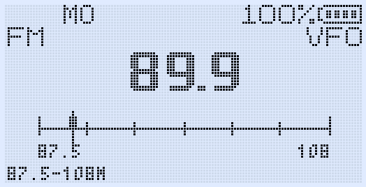
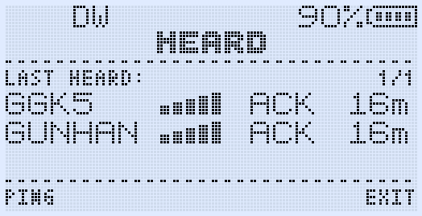
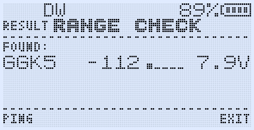
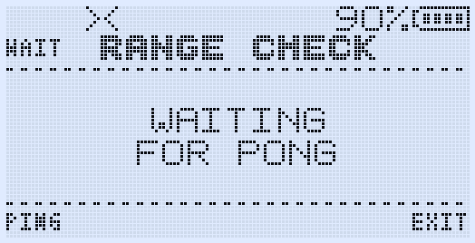
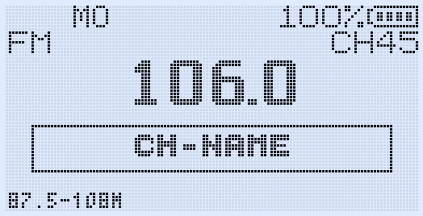
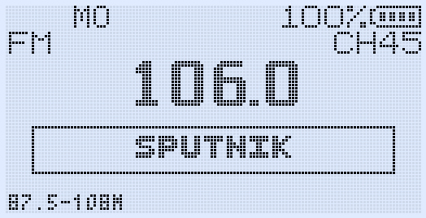
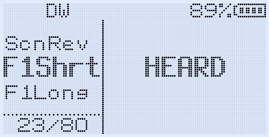

# GOGUFW Messenger Edition

Advanced F4HWN Fusion 5.6.0 based firmware for the Quansheng UV-K1 (BK4829).

> GOGUFW preserves all features of F4HWN Fusion 5.6.0 and extends the UV-K1 with digital messaging, station discovery, emergency communication tools and enhanced user interface functionality.



---

## What is GOGUFW?

GOGUFW is a messaging-focused firmware fork for Quansheng UV-K1 / BK4829 radios.

Unlike a simple menu or UI modification, GOGUFW turns the UV-K1 into a practical field communication tool by adding:

- Digital text messaging
- Automatic delivery acknowledgements
- Station discovery
- Range Check
- HEARD station list
- FM broadcast memory naming
- CALLTX call tones
- Survival Mode
- Screen saver modes
- CHIRP support for GOGUFW-specific settings

GOGUFW is based on the F4HWN Fusion 5.6.0 codebase and keeps the original Fusion feature set available.

---

## Main Features

- UV-K1 Messenger with Inbox, Compose, Sent, Drafts, Reply, Delete and Resend flows
- Boot-time RF message receive without opening Messenger first
- ACK/retry messaging with VFO-aware ACK return
- Sent message ACK source tracking
- Four-entry ACK queue for improved reliability
- ACK collect window after the first delivery confirmation
- Persistent Messenger settings, drafts and callsign storage using the GOGUFW private flash sector
- Shared T9 editor with multi-tap timeout and ABC/abc cycling
- Global message beep, unread icon and unread notification behavior
- HEARD station list
- Range Check for UV-K1 to UV-K1 testing using the Messenger FSK infrastructure
- F+9 CALLTX call-tone feature with selectable tone preview screen
- FM broadcast radio UI refinements and memory-channel naming
- SetSav screen saver system
- Survival Mode
- Assignable shortcuts for Messenger, HEARD and CALLTX
- UV-K5-style RSSI bars in HEARD and Range Check
- VS Code and Docker build support

---

## Messenger

Messenger is the flagship feature of GOGUFW.

It enables low-speed digital text communication directly between GOGUFW radios without requiring external devices.

### Messenger Features

- Compose messages directly on the radio
- Inbox
- Sent messages
- Draft storage
- Reply
- Delete
- Resend
- Automatic ACK confirmation
- Automatic retry system
- Duplicate packet filtering
- Unread message notification
- Delivery tracking
- ACK source display

---

### Message Composer

Create and edit messages directly from the radio.


---

### Inbox

Received messages are stored in the Inbox and tracked as read or unread.


---

### Message Reader

Read received messages together with sender information.


---

### Sent Message Tracking

Sent messages show delivery status and ACK sources.

This makes it possible to see which stations confirmed reception.


---

## ACK and Delivery System

GOGUFW includes a delivery confirmation system designed for real radio conditions.

### ACK Features

- Single ACK packet transmission
- Automatic retry when ACK is not received
- ACK collection window after first ACK
- Up to three ACK sources shown on the Sent read screen
- Four-entry ACK queue on the receiving side
- Busy-channel and FSK-RX aware ACK defer logic
- Duplicate ACK filtering

The ACK source list is especially useful for group or broadcast-style communication, because the sender can see which stations actually received the message.

---

## HEARD

HEARD automatically tracks recently received GOGUFW stations.

Displayed information:

- Callsign
- Packet type
- Last heard age
- RSSI
- Signal strength indicator

Features:

- Automatic updates
- Compact station overview
- UV-K5-style RSSI bars
- Fast shortcut access



---

## Range Check

Range Check allows nearby GOGUFW stations to discover each other and evaluate signal quality.

Features:

- Ping / Pong discovery
- Callsign identification
- RSSI reporting
- Voltage reporting
- Signal strength display
- Automatic station sorting
- Busy-channel aware PONG defer logic
- Reduced RF traffic with single PING and single PONG packets



---

### Waiting for Responses

While listening for replies, Range Check continues monitoring nearby stations and updates the result list when PONG packets arrive.



---

## FM Broadcast Naming

GOGUFW adds FM broadcast station naming support.

This allows saved FM broadcast memories to show readable names instead of only frequency values.

Examples:

- BBC
- NEWS
- ROCK FM
- LOCAL





---

## Assignable Shortcuts

GOGUFW functions can be assigned directly to shortcut keys.

Supported functions:

- Messenger
- HEARD
- Range Check
- CALLTX

Supported shortcut locations:

- F1 Short Press
- F1 Long Press
- F2 Short Press
- F2 Long Press
- MENU Long Press



---

## CALLTX

CALLTX provides PMR-style call tone transmission.

Features:

- Multiple selectable call tones
- Preview mode
- Fast access through shortcuts
- Quick station alerting

F+9 remains assigned to CALLTX.

---

## Backlight Shortcut

F+8 uses a three-step backlight cycle:

1. Backlight Always ON
2. Backlight Always OFF
3. Return to normal BackLt strategy

This keeps F+9 available for CALLTX.

---

## Screen Saver System

GOGUFW includes the SetSav screen saver system.

Available modes:

- OFF
- LOGO
- LOGO+
- MATRIX

Features:

- Integrated backlight management
- Power-saving support
- Improved wake-up behavior
- Main-screen operation

---

## Survival Mode

Survival Mode is designed for disaster and emergency communication scenarios.

Activation:

**Hold PTT + SET while powering on**

Survival Mode features:

- Messenger disabled
- HEARD disabled
- Range Check disabled
- Dual Watch disabled
- Simplified radio-only operation
- Reduced complexity
- Dedicated emergency mode

---

## RSSI Visualization

GOGUFW adds improved RSSI visualization across several screens.

Features:

- UV-K5-style RSSI bars
- HEARD signal bars
- Range Check signal bars
- RSSI graph support during scan-related functions

---

## CHIRP Support

A dedicated GOGUFW CHIRP module is available.

Supported features:

- FM channel names
- Shortcut assignments
- Messenger settings
- F4HWN settings
- SetSav configuration

---

## Important Storage Note

GOGUFW Messenger configuration uses the private flash sector at `0x012000`.

The older 0.3.3 storage location at EEPROM compatibility address `0x1E80` was intentionally abandoned because it overlaps the channel-memory compatibility area.

No automatic migration is performed from that legacy address for safety.

---

## Build

Docker Desktop must be installed and running.

```bash
chmod +x ./compile-with-docker.sh
./compile-with-docker.sh
```

The internal CMake preset may still be named `Fusion` because GOGUFW uses the F4HWN Fusion feature set.

---

## VS Code Build

See:

```text
BUILD_WITH_VSCODE.md
```

---

## Compatibility

Supported hardware:

- Quansheng UV-K1 / BK4829

Base firmware:

- F4HWN Fusion 5.6.0

All Fusion 5.6.0 functionality is preserved and remains available.

---

## Added by GOGUFW

In addition to all F4HWN Fusion 5.6.0 functionality, GOGUFW adds:

- Messenger
- HEARD
- Range Check
- Survival Mode
- FM Naming
- CALLTX
- SetSav Screen Saver
- Assignable Messenger Shortcuts
- Sent ACK Tracking
- ACK Queue
- ACK Collect Window
- UV-K5-style RSSI Bars
- Enhanced Range Check Interface
- Enhanced HEARD Interface
- Enhanced Delivery Tracking System

---

## Attribution

Based on the F4HWN / UV-K5 custom firmware project.

Original license and attribution are preserved in this repository.

---

## Credits

### Original Firmware

F4HWN Fusion Team

### GOGUFW Development

Gökhan Gunalp

### Community Testing

The Quansheng and F4HWN communities

---

## Disclaimer

This firmware is provided as-is.

Users are responsible for complying with local radio regulations and operating only within frequencies and modes permitted by their license and jurisdiction.
