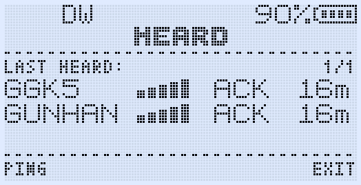
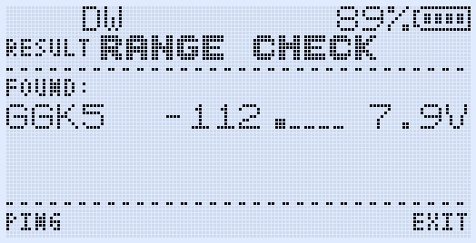
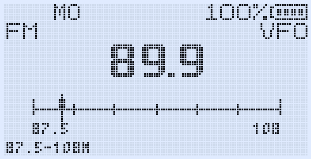
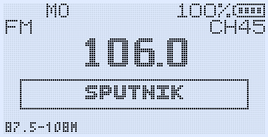
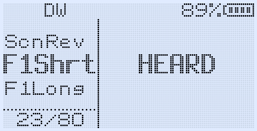

# GOGUFW 1.2.0

GOGUFW is a custom firmware for the Quansheng UV-K1 / UV-K5 V3, built on the F4HWN Fusion firmware and focused on radio-to-radio messaging and practical everyday tools.

Version **1.2.0** combines selected F4HWN 5.9.0 improvements with GOGUFW's Messenger, HEARD, Range Check, CALLTX and FM radio additions.

[Download the latest release](https://github.com/Gogu-Qs/GOGUFW-UV-K1-Messenger/releases/latest)

## What GOGUFW adds

- **Messenger:** compose and receive text messages directly on the radio, with Inbox, Sent, Drafts, Reply, Resend and delivery acknowledgements.
- **HEARD:** view recently heard Messenger stations together with callsign, signal level, packet type and age.
- **Range Check:** send a PING and receive the other radio's callsign, signal level and battery voltage.
- **CALLTX:** transmit one of five selectable call melodies, with volume selection and tone preview in the menu.
- **FM radio tools:** save station names, rename or delete memories, and follow the live FM signal-strength meter.
- **Custom shortcuts:** open Messenger and HEARD quickly or transmit CALLTX from programmable side keys.
- **GOGUFW CHIRP module:** configure supported radio settings, custom key actions and FM station names from CHIRP.

The normal F4HWN Fusion radio features remain available alongside these additions.

## Shortcuts

| Function | Shortcut | What it does |
| --- | --- | --- |
| Messenger | **F + MENU** | Opens Messenger directly from the main radio screen. |
| HEARD / Range Check | **F + 7** | Opens the HEARD screen. Press **MENU** there to start a Range Check PING. |
| CALLTX | **F + 9** | Transmits the selected call melody. |
| Messenger | Assign **MESSENGER** to a programmable side-key action | Opens Messenger. Pressing the same assigned key on the Messenger home screen closes it. |
| HEARD | Assign **HEARD** to a programmable side-key action | Opens HEARD / Range Check. Pressing the same assigned key again closes it. |
| CALLTX | Assign **CALLTX** to a programmable side-key action | Transmits the selected call melody directly. |

The programmable actions can be assigned to the short or long press of the side keys from the radio menu or the included CHIRP module.

## Screens

### Messenger

| Messenger home | Compose a message |
| --- | --- |
|  |  |

### HEARD and Range Check

| Recently heard stations | Range Check result |
| --- | --- |
|  |  |

### FM radio

| Live FM signal meter | Named FM station memory |
| --- | --- |
|  |  |

### Programmable key actions



## Download and compatibility

The current stable release is **GOGUFW 1.2.0**. Its release page includes:

- the Fusion firmware `.bin` file;
- the matching `Gogufw_1.2.0_chirp_module.py` CHIRP module.

GOGUFW is intended for Quansheng UV-K1 / UV-K5 V3 variants using the **PY32F071 MCU and BK4829 RF IC**. It is not intended for unrelated BK4819-based radios.

[Open the GOGUFW 1.2.0 release](https://github.com/Gogu-Qs/GOGUFW-UV-K1-Messenger/releases/tag/v1.2.0)

## Build from source

The Fusion preset requires CMake, Ninja and the ARM GNU Embedded toolchain (`arm-none-eabi-gcc`):

```bash
cmake --preset Fusion
cmake --build --preset Fusion
```

For setup instructions, see [BUILD_VSCODE_MAC.md](BUILD_VSCODE_MAC.md) or [BUILD_WITH_VSCODE.md](BUILD_WITH_VSCODE.md).

## Credits

GOGUFW is based on the F4HWN / UV-K5 custom firmware project and retains the original project attribution and license. Thanks to the F4HWN contributors for the firmware foundation on which these additions were built.

## Disclaimer

This firmware is provided as-is. Users are responsible for complying with the radio regulations, licensing requirements and permitted frequencies applicable in their jurisdiction.
