# GOGUFW 2.3.0

GOGUFW is a custom firmware for the Quansheng UV-K1 / UV-K5 V3 based on **F4HWN 6.0.0 (Multiboot)**. It keeps the F4HWN radio feature set and adds an integrated radio-to-radio Messenger, HEARD list, multi-radio Range Check, CALLTX melodies, RF Log Lite, named FM memories, an Action Picker, per-channel scrambling and a multiboot environment.

## Firmware at a glance

| Statistic | Project status |
| --- | --- |
| 📦 **Current stable release** | GOGUFW 2.3.0 |
| 👁️ **Repository views** | [](https://hits.sh/github.com/Gogu-Qs/GOGUFW-UV-K1-Messenger/) |
| ⬇️ **Release downloads** | [](https://github.com/Gogu-Qs/GOGUFW-UV-K1-Messenger/releases) |
| ⭐ **GitHub stars** | [](https://github.com/Gogu-Qs/GOGUFW-UV-K1-Messenger/stargazers) |
| 🍴 **GitHub forks** | [](https://github.com/Gogu-Qs/GOGUFW-UV-K1-Messenger/forks) |
| 🧩 **Firmware base** | **F4HWN 6.0.0 (Multiboot)** |
| 📻 **Supported radios** | Quansheng UV-K1 / UV-K5 V3 |
| ⚙️ **Hardware** | PY32F071 MCU · BK4829 RF IC |
| 🛠️ **Build preset** | Fusion · Release · ARM GNU Embedded |
| 💾 **Multiboot image** | 119,648 / 120,832 bytes · **99.02%** · 1,184 bytes free |
| 🧠 **RAM usage** | 13,520 / 16,384 bytes · **82.52%** · 2,864 bytes free |
| ✉️ **GOGUFW tools** | Messenger · HEARD · Range Check · CALLTX · RF Log Lite · Action Picker · FM names/RSSI · Scrambler |
| 🔌 **CHIRP support** | Matching 2.3.0 module with 1024 memories, Messenger settings, FM names, channel policies and Scrambler |

## Compatibility and downloads

GOGUFW is intended only for Quansheng **UV-K1 / UV-K5 V3** radios built around the **PY32F071 MCU and BK4829 RF IC**. Do not install it on UV-K5 V1/V2 or other BK4819-based radios.

The current release contains:

- `f4hwn.gogufw.v2.3.0.bin` — the multiboot-compatible firmware image;
- `Gogufw_2.3.0_chirp_module.py` — the matching custom CHIRP module.

[Download GOGUFW 2.3.0](https://github.com/Gogu-Qs/GOGUFW-UV-K1-Messenger/releases/tag/v2.3.0)

Back up the radio with CHIRP before updating and keep a known-good DFU recovery image available.

## Main features

### Messenger

Messenger sends and receives short text messages directly between compatible GOGUFW radios over FSK. It works as a sidecar to normal analog operation, so receiving messages does not require leaving the Messenger screen open.

- 36-character messages with T9-style text entry;
- 16-message Inbox, 8-message Sent list and 8 editable quick-message Drafts;
- delivery acknowledgements, retry status and up to three responding callsigns;
- Reply, Resend and Delete controls;
- duplicate-message protection;
- callsign, receive, ACK, alert-beep and LED settings;
- a short wake frame before the first normal message attempt to improve reception while the destination radio is idle;
- per-channel **No FSK TX** protection for channels where Messenger transmission must remain disabled;
- TX-frequency, F Lock, modulation and channel-policy checks before every message, retry, ACK, PING or PONG;
- a clear TX-blocked popup that identifies No FSK, frequency, modulation, configuration or battery restrictions.

Open Messenger with **F + MENU**, or assign **MESSENGER** to a side key. The assigned Messenger action is a toggle: use it again on the Messenger home screen to return to the radio.

| Messenger hub | Messaging preferences |
| --- | --- |
| 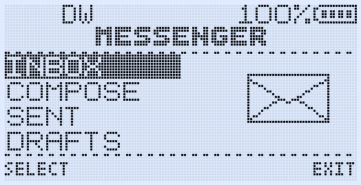 | 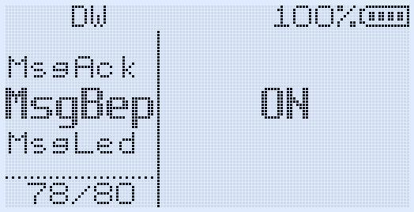 |

| New message editor | Message ready to send |
| --- | --- |
| 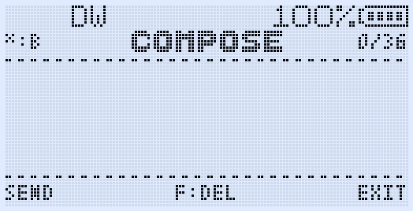 | 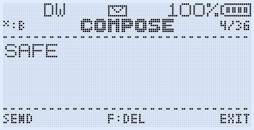 |

| Quick-message drafts | Received message view |
| --- | --- |
| 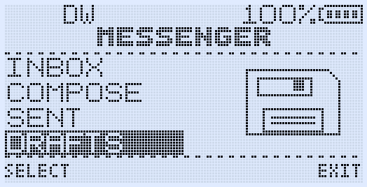 | 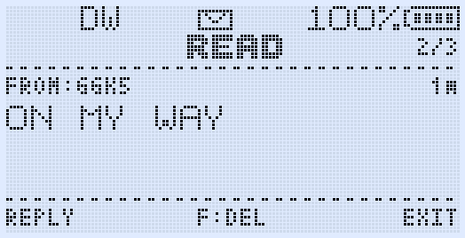 |

| Delivery overview | Sent message details |
| --- | --- |
| 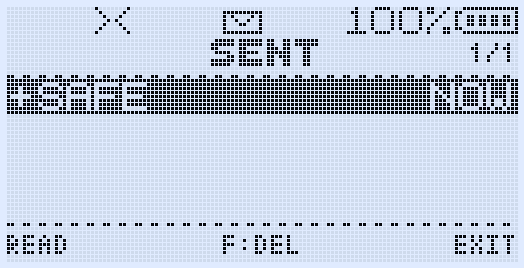 | 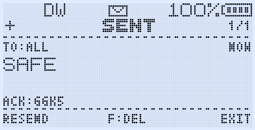 |

#### Messenger controls

| Screen | Controls |
| --- | --- |
| Home | **UP/DOWN** selects Inbox, Compose, Sent or Drafts; **MENU** opens; **EXIT** returns to the radio. |
| Inbox / Sent | Four visible rows; **UP/DOWN** selects; **MENU** reads; **F** deletes; **EXIT** returns. Inbox rows show unread state, sender, preview and age; Sent rows show delivery state, preview and age. |
| Read | **UP/DOWN** changes message; **MENU** replies or resends; **F** deletes; **EXIT** returns. |
| Compose / Draft edit | Number keys enter text; hold a number for the digit; **STAR** cycles `B`/`b`/`2`; **F** deletes; **MENU** sends; **EXIT** returns. |

### HEARD and Range Check

HEARD records recently received Messenger packets with callsign, RSSI, packet type and age. Range Check sends a PING and collects PONG replies from multiple GOGUFW radios, showing the remote callsign, RSSI and battery voltage.

- Open HEARD with **F + 7**, or assign **HEARD** to a side key.
- Press **MENU** on HEARD to start a 12-second Range Check.
- Use **UP/DOWN** to move through results one entry at a time. The first **EXIT** from Range Check returns to HEARD; the next returns to the radio.
- `RngRsp` controls automatic PONG replies.
- Randomized ACK and PONG timing reduces collisions when several radios answer together.

The assigned HEARD action also behaves as a toggle.

| No recent activity | Recently heard stations |
| --- | --- |
| 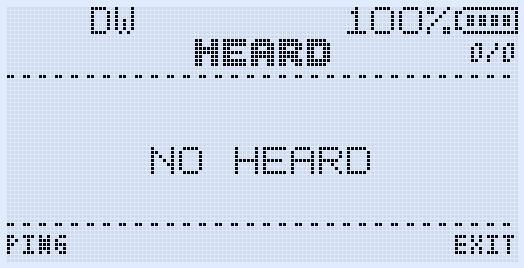 | 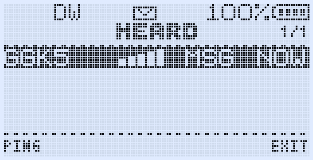 |

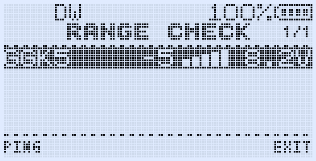

### Action Picker

The Action Picker gives temporary access to the complete programmable side-key action list without repeatedly changing the saved side-key assignment.

1. Briefly press **F**.
2. Hold **SIDE1** or **SIDE2** to open that key's picker.
3. Use **UP/DOWN** to choose an action.
4. Press **MENU** to run it, or **EXIT/F** to cancel.

Each side key remembers its last picker selection. The picker is available on the main radio screen, Messenger Home, HEARD/idle Range Check and the normal FM radio screen. It deliberately stays out of Inbox, Sent, Read, Compose, active Range Check collection and FM edit/confirmation screens so their existing controls remain intact. **PTT** closes the picker and continues normally.

Some radio actions are unsafe while the FM receiver is active; selecting one of those actions in FM gives a double warning beep instead of changing radio state.

### RF Log Lite

RF Log Lite is GOGUFW's compact, low-memory activity history. It keeps the latest 20 completed analog RX/TX events and shows the channel name or VFO frequency, direction, `MM:SS` duration and age. The list is stored only in RAM and is cleared when the radio restarts, avoiding external-flash writes.

Open **RF LOG** from the Action Picker, or assign it directly to a programmable side-key action. Use **UP/DOWN** to browse one entry at a time, **MENU / SELECT** to load the selected memory channel or frequency into the active VFO, and **EXIT** to return without changing it.

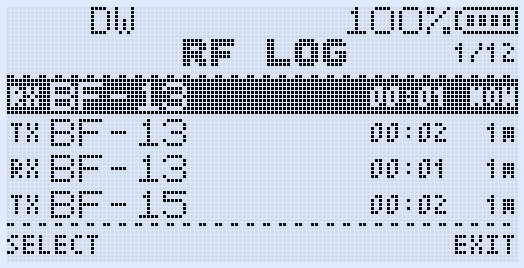

### CALLTX

CALLTX transmits one of five selectable alert melodies using the existing radio TX path.

- **F + 9** transmits the selected melody.
- `CllTon` selects the melody and provides a preview.
- `CllVol` selects low or high tone-generator level.
- The melody completes its current phrase without clipping the final note.
- CALLTX does not append the normal Roger beep or MDC tail.
- Assign **CALLTX** to a side key for direct access.

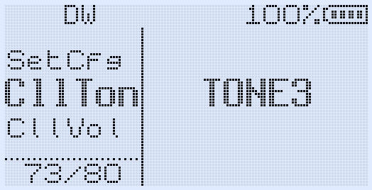

### FM broadcast radio

The FM radio includes named station memories, rename/delete controls and a signal-strength display. **LIVE RSSI** is the first menu item in both VFO and memory modes: ON updates the meter continuously and shows `LIVE`; OFF samples once after tuning and keeps the meter fixed to avoid periodic clicking on quiet broadcasts. Occupied save targets show their channel number and station name before confirmation.

The Action Picker can also be opened from the normal FM screen. It is disabled while entering a frequency, editing a station name, choosing save/delete operations or confirming an automatic scan.

| Saved broadcast station | Manual FM tuning |
| --- | --- |
| 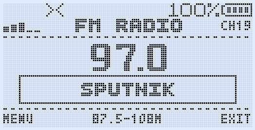 | 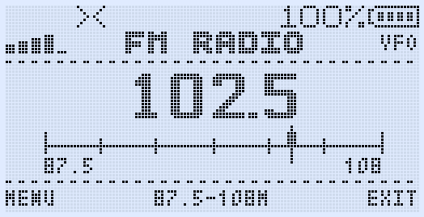 |

### Search Frequency and Search Tone

Open **Search Frequency** with **F + 4**, or **Search Tone** with **F + STAR**. Both screens use the same header, status, frequency/tone rows and footer controls as the other GOGUFW tools.

After a result is found, press **MENU / SAVE**, choose a destination memory with **UP/DOWN** or the number keys, then press **MENU** and confirm `SAVE?`. Empty targets are marked `CH-xxxx`; occupied targets show the channel number and name, shortened with `..` when necessary. A saved result opens directly in MR mode without also opening the main menu.

Scanner-created memories preserve the power setting that was active before the search, use **NARROW** bandwidth, and store airband results as **AM** rather than FM.

| Frequency discovery | Tone identification |
| --- | --- |
| 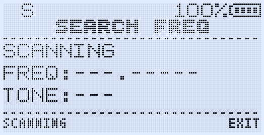 | 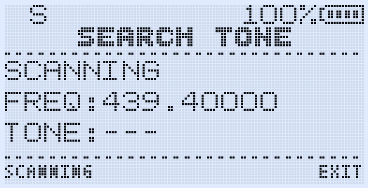 |

### Per-channel scrambler

The `Scramb` channel menu selects **OFF** or an inversion frequency from **2600 Hz to 3500 Hz**. The setting is stored separately for each memory channel and is also available in the matching CHIRP module.

The analog voice scrambler is not encryption and may be restricted by local radio regulations. Use it only where permitted.

### Channel policies and main-screen indicators

- **No FSK TX** blocks Messenger and Range Check transmission on an individual memory channel while leaving ordinary voice TX and FSK reception available.
- **No Roger** suppresses the selected Roger beep or MDC tail on an individual memory channel.
- The radio-wave icon indicates that FSK TX is permitted on that memory channel.
- The musical-note icon indicates that the global Roger/MDC selection is active and permitted on that memory channel.

These settings appear as normal memory-list columns and under **Properties → Extra** in the custom CHIRP module.

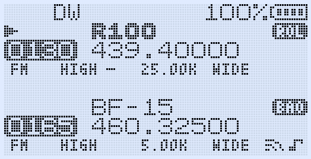

### Spectrum

Open Spectrum with **F + 5**.

- From MR mode it scans valid stored memories and displays the selected channel name and frequency.
- From VFO mode it scans a continuous frequency range.
- Press **PTT** on a peak to stop and listen.
- Press **MENU** while listening to inspect or adjust LNA/PGA controls.
- Press **PTT** again to open the stored MR channel or transfer a VFO peak to the active VFO; this does not transmit.
- **UP/DOWN** resumes scanning, **EXIT** returns and **SIDE1** temporarily excludes the current peak.

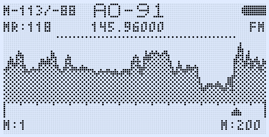

### Multiboot

Hold **MENU while powering on** to open the firmware-slot selector.

- On first use, GOGUFW creates a one-time backup of the Main firmware in slot 0. Do not interrupt `Init Main`.
- Slot images are completely CRC-checked before internal Flash is erased.
- Each slot uses a private settings bank by default, including Messenger settings/drafts and FM station names.
- `SetCfg` can deliberately pair a slot with a compatible settings bank.
- Calibration and the boot logo remain shared.
- GOGUFW can run as Main or from a slot and uses the official F4HWN multiboot image format.

### Survival Mode

Survival Mode is a temporary basic-radio session for voice operation with fewer background features. Messenger/FSK, HEARD/Range Check, scanning, FM radio, Spectrum, Dual Watch, cross-band operation and VOX are disabled for that session.

Hold **PTT + SetKey while powering on**. The default SetKey is **MENU**, so the default shortcut is **PTT + MENU + Power**. The `SetKey` menu can change the trigger to MENU, UP, DOWN, EXIT or STAR. Power-cycle normally to return to full operation; saved settings are not overwritten.

## Quick shortcuts

| Function | Shortcut |
| --- | --- |
| Messenger | **F + MENU** |
| HEARD / Range Check | **F + 7** |
| CALLTX | **F + 9** |
| Spectrum | **F + 5** |
| Backlight override cycle | **F + 8**: always on → always off → saved strategy |
| Keypad lock | Hold **F** |
| Action Picker | Press **F**, then hold **SIDE1** or **SIDE2** |
| RF Log Lite | Select **RF LOG** in the Action Picker or assign it to a side key |
| Multiboot | Hold **MENU** while powering on |
| Survival Mode | Hold **PTT + SetKey** while powering on |

## CHIRP

Use the module that matches the firmware release. For GOGUFW 2.3.0:

1. Start CHIRP and choose **File → Load Module**.
2. Select `Gogufw_2.3.0_chirp_module.py`.
3. Download the radio using **Quansheng → UV-K1 / UV-K5 V3 GOGUFW Messenger**.
4. Edit channels, side-key actions, Messenger/Call settings, FM names, `No FSK TX`, `No Roger` and Scrambler as required.
5. Upload the completed image to the radio.

The firmware and module support the radio's 1024 memory-channel layout. Do not use an older GOGUFW module with this release: an older module may not understand newer key-action or channel fields and can overwrite them.

## Build from source

The Fusion preset requires CMake, Ninja and the ARM GNU Embedded toolchain (`arm-none-eabi-gcc`):

```bash
cmake --preset Fusion --fresh
cmake --build --preset Fusion
```

The build emits the normal `gogufw.bin` and the canonical multiboot filename `f4hwn.gogufw.v2.3.0.bin`. See `BUILD_VSCODE_MAC.md` or `BUILD_WITH_VSCODE.md` for environment setup.

## Credits and license

GOGUFW is based on F4HWN Fusion and the wider Quansheng custom-firmware community's work. The original project attribution and licenses are retained. Thanks to everyone who reports real-radio results and helps test Messenger, Range Check and radio safety behavior.

This firmware is provided as-is. Users are responsible for complying with the licensing, frequency, power and emission rules applicable in their jurisdiction.
