# GOGUFW 3.1.0

GOGUFW is a custom firmware for the Quansheng UV-K1 / UV-K5 V3 based on **F4HWN 6.0.0 (Multiboot)** with Full Watch ported from **F4HWN 6.1.0**. It keeps the F4HWN radio feature set and adds an integrated radio-to-radio Messenger, HEARD list, multi-radio Range Check, CALLTX melodies, RF Log Lite, named FM memories and a multiboot environment.

## Firmware at a glance

| Statistic | Project status |
| --- | --- |
| 📦 **Current stable release** | GOGUFW 3.1.0 |
| 👁️ **Repository views** | [](https://hits.sh/github.com/Gogu-Qs/GOGUFW-UV-K1-Messenger/) |
| ⬇️ **Release downloads** | [](https://github.com/Gogu-Qs/GOGUFW-UV-K1-Messenger/releases) |
| ⭐ **GitHub stars** | [](https://github.com/Gogu-Qs/GOGUFW-UV-K1-Messenger/stargazers) |
| 🍴 **GitHub forks** | [](https://github.com/Gogu-Qs/GOGUFW-UV-K1-Messenger/forks) |
| 🧩 **Firmware base** | **F4HWN 6.0.0 (Multiboot)** + Full Watch from 6.1.0 |
| 📻 **Supported radios** | Quansheng UV-K1 / UV-K5 V3 |
| ⚙️ **Hardware** | PY32F071 MCU · BK4829 RF IC |
| 🛠️ **Build preset** | Fusion · Release · ARM GNU Embedded |
| 💾 **Multiboot image** | 120,636 / 120,832 bytes · **99.84%** · 196 bytes free |
| 🧠 **RAM usage** | 13,744 / 16,384 bytes · **83.89%** · 2,640 bytes free |
| ✉️ **GOGUFW tools** | Messenger · HEARD · Range Check · CALLTX · RF Log Lite · Full Watch · FM names/RSSI |
| 🔌 **CHIRP support** | Matching 3.1.0 module with 1024 memories, Messenger settings, FM names and channel policies |

## Compatibility and downloads

GOGUFW is intended only for Quansheng **UV-K1 / UV-K5 V3** radios built around the **PY32F071 MCU and BK4829 RF IC**. Do not install it on UV-K5 V1/V2 or other BK4819-based radios.

The current release contains:

- `f4hwn.gogufw.v3.1.0.bin` — the multiboot-compatible firmware image;
- `Search-v1.2-gogu.zip` — corrected Search Frequency + Search Tone overlay app;
- `APRSEdit-message-only-v1.1-gogu.zip` — corrected optional APRS message editor;
- `Gogufw_3.1.0_chirp_module.py` — the matching custom CHIRP module.

[Download GOGUFW 3.1.0](https://github.com/Gogu-Qs/GOGUFW-UV-K1-Messenger/releases/tag/v3.1.0)

Back up the radio with CHIRP before updating and keep a known-good DFU recovery image available.

## What's new in 3.1.0

- Added F4HWN 6.1.0 Full Watch, including priority-channel Triple/Quad Watch display and receive handling.
- In Full RX/Respond, the A/B action cycles through A, B and the valid priority channels; the displayed selection is used by manual PTT.
- Main TX/Full RX supports the same watched-target selection; a manually selected watched target becomes the PTT target, and channel-menu edits apply to the displayed priority target.
- Restored the resident SysInfo capability and rebuilt the compatible `SystemInfo.app` overlay.
- Full Watch now temporarily clears its middle-line indicator while `UNLOCK KEYBOARD` is shown and restores it when the notice expires.
- Removed Survival Mode and Action Picker from the Fusion firmware image.
- Combined HEARD and Range Check into one persistent activity screen.
- Completed the late F4HWN stability/size fixes and made Quad Watch visit every channel before a battery-save sleep interval.

See [CHANGELOG.md](CHANGELOG.md) for the complete list of changes since 2.3.1.

## Main features

### Messenger

Messenger sends and receives short text messages directly between compatible GOGUFW radios over FSK. It works as a sidecar to normal analog operation, so receiving messages does not require leaving the Messenger screen open.

- 36-character messages with T9-style text entry;
- 16-message Inbox, 8-message Sent list and 8 editable quick-message Drafts;
- delivery acknowledgements, retry status and up to three responding callsigns;
- Reply, Resend and Delete controls;
- duplicate-message protection;
- callsign, receive, ACK, alert-beep and LED settings;
- a short wake frame before the first normal message attempt to improve reception while the destination radio is idle;
- per-channel **No FSK TX** protection for channels where Messenger transmission must remain disabled;
- TX-frequency, F Lock, modulation and channel-policy checks before every message, retry, ACK, PING or PONG;
- a clear TX-blocked popup that identifies No FSK, frequency, modulation, configuration or battery restrictions.

Open Messenger with **F + MENU**, or assign **MESSENGER** to a side key. The assigned Messenger action is a toggle: use it again on the Messenger home screen to return to the radio.

| Messenger hub | Messaging preferences |
| --- | --- |
| 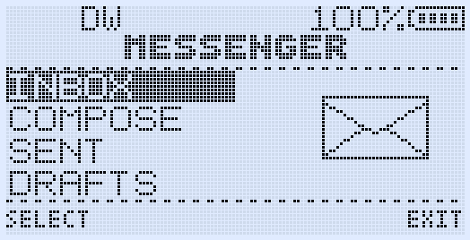 | 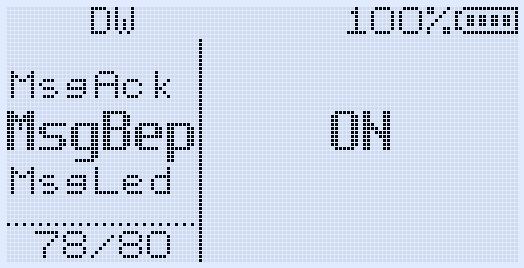 |

| New message editor | Message ready to send |
| --- | --- |
| 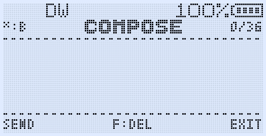 | 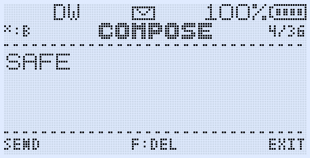 |

| Quick-message drafts | Received message view |
| --- | --- |
| 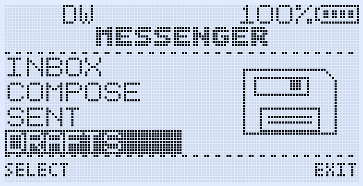 | 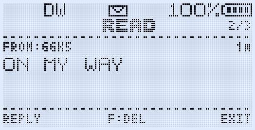 |

| Delivery overview | Sent message details |
| --- | --- |
| 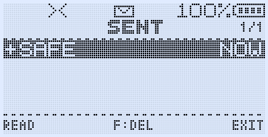 | 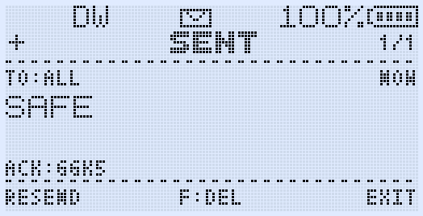 |

#### Messenger controls

| Screen | Controls |
| --- | --- |
| Home | **UP/DOWN** selects Inbox, Compose, Sent or Drafts; **MENU** opens; **EXIT** returns to the radio. |
| Inbox / Sent | Four visible rows; **UP/DOWN** selects; **MENU** reads; **F** deletes; **EXIT** returns. Inbox rows show unread state, sender, preview and age; Sent rows show delivery state, preview and age. |
| Read | **UP/DOWN** changes message; **MENU** replies or resends; **F** deletes; **EXIT** returns. |
| Compose / Draft edit | Number keys enter text; hold a number for the digit; **STAR** cycles `B`/`b`/`2`; **F** deletes; **MENU** sends; **EXIT** returns. |

### HEARD and Range Check

HEARD records recently received Messenger packets with callsign, battery voltage when available, RSSI bar and numeric RSSI, packet type and age. Range Check now runs directly inside the same list instead of opening a separate result view.

- Open HEARD with **F + 7**, or assign **HEARD** to a side key.
- Press **MENU** on HEARD to start a 12-second Range Check. A `WAIT` indicator appears at the far-left of the header and the lower-left action changes from `PING` to `WAIT` before PING transmission starts.
- Existing MSG, ACK, PNG and PON rows remain visible during the check. Each responding station is moved to the top with its voltage and RSSI details.
- Each row uses four separated groups: station ID with voltage, RSSI bar with numeric RSSI, packet type, and age. Voltage, numeric RSSI, packet type and age use a compact font aligned to the bottom of the normal-font station ID.
- Use **UP/DOWN** to move through entries and **EXIT** to return to the radio.
- `RngRsp` controls automatic PONG replies.
- Randomized ACK and PONG timing reduces collisions when several radios answer together.

The assigned HEARD action also behaves as a toggle.

| No recent activity | Recently heard stations |
| --- | --- |
| 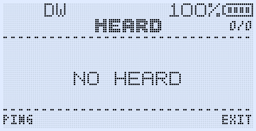 | 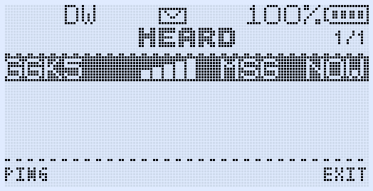 |

### RF Log Lite

RF Log Lite is GOGUFW's compact, low-memory activity history. It keeps the latest 20 completed analog RX/TX events and shows the channel name or VFO frequency, direction, `MM:SS` duration and age. The list is stored only in RAM and is cleared when the radio restarts, avoiding external-flash writes.

Assign **RF LOG** directly to a programmable side-key action. Use **UP/DOWN** to browse one entry at a time, **MENU / SELECT** to load the selected memory channel or frequency into the active VFO, and **EXIT** to return without changing it.

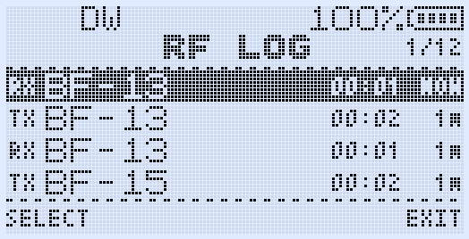

### CALLTX

CALLTX transmits one of five selectable alert melodies using the existing radio TX path.

- **F + 9** transmits the selected melody.
- `CllTon` selects the melody and provides a preview.
- `CllVol` selects low or high tone-generator level.
- The melody completes its current phrase without clipping the final note.
- CALLTX does not append the normal Roger beep or MDC tail.
- Assign **CALLTX** to a side key for direct access.

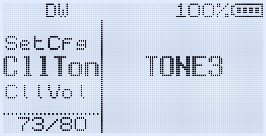

### FM broadcast radio

The FM radio includes named station memories, rename/delete controls and a signal-strength display. **LIVE RSSI** is the first menu item in both VFO and memory modes: ON updates the meter continuously and shows `LIVE`; OFF samples once after tuning and keeps the meter fixed to avoid periodic clicking on quiet broadcasts. Occupied save targets show their channel number and station name before confirmation.

| Saved broadcast station | Manual FM tuning |
| --- | --- |
| 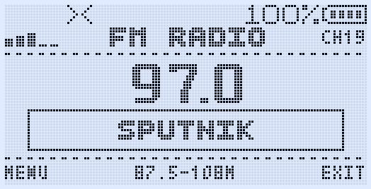 | 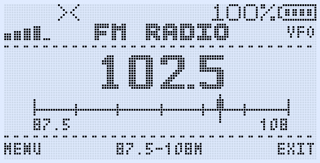 |

### Search Frequency and Search Tone

Open **Search Frequency** with **F + 4**, or **Search Tone** with **F + STAR**. Both screens use the same header, status, frequency/tone rows and footer controls as the other GOGUFW tools.

> **GOGUFW 3.1.0 requires Search v1.2-gogu.** This build uses the corrected append-only overlay API and follows the displayed Full Watch A/B/C/D channel after watch rotations. Replace an older Search app before testing the shortcuts.

After a result is found, press **MENU / SAVE**, choose a destination memory with **UP/DOWN** or the number keys, then press **MENU** and confirm `SAVE?`. Empty targets are marked `CH-xxxx`; occupied targets show the channel number and name, shortened with `..` when necessary. A saved result opens directly in MR mode without also opening the main menu.

Scanner-created memories preserve the power setting that was active before the search, use **NARROW** bandwidth, and store airband results as **AM** rather than FM.

| Frequency discovery | Tone identification |
| --- | --- |
| 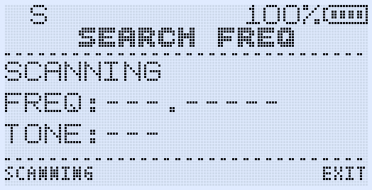 | 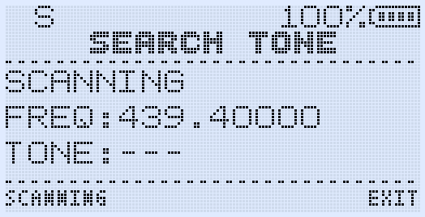 |

### Overlay apps and corrected APRS Edit

GOGUFW provides 16 external-Flash app slots. Install `.app` files from the **Apps** page in Armel's UV Studio while the radio is running normally.

`APRSEdit-message-only-v1.1-gogu.app` is the corrected optional editor for the 23-character message/comment used by Armel's APRS TX app. Version 1.1 is rebuilt against GOGUFW 3.1.0's stable API layout, so it opens normally and can load/save the APRS TX comment again. APRS TX must already be installed.

### Channel policies and main-screen indicators

- **No FSK TX** blocks Messenger and Range Check transmission on an individual memory channel while leaving ordinary voice TX and FSK reception available.
- **No Roger** suppresses the selected Roger beep or MDC tail on an individual memory channel.
- The radio-wave icon indicates that FSK TX is permitted on that memory channel.
- The musical-note icon indicates that the global Roger/MDC selection is active and permitted on that memory channel.

These settings appear as normal memory-list columns and under **Properties → Extra** in the custom CHIRP module.

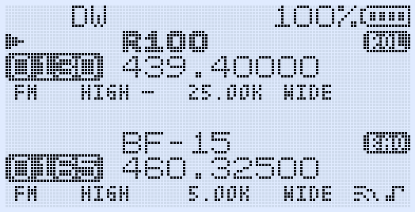

### Spectrum

Open Spectrum with **F + 5**.

- From MR mode it scans valid stored memories and displays the selected channel name and frequency.
- From VFO mode it scans a continuous frequency range.
- Press **PTT** on a peak to stop and listen.
- Press **MENU** while listening to inspect or adjust LNA/PGA controls.
- Press **PTT** again to open the stored MR channel or transfer a VFO peak to the active VFO; this does not transmit.
- **UP/DOWN** resumes scanning, **EXIT** returns and **SIDE1** temporarily excludes the current peak.

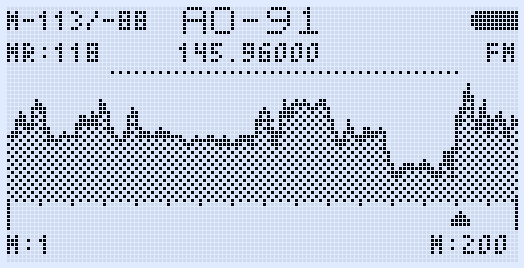

### Multiboot

Hold **MENU while powering on** to open the firmware-slot selector.

- On first use, GOGUFW creates a one-time backup of the Main firmware in slot 0. Do not interrupt `Init Main`.
- Slot images are completely CRC-checked before internal Flash is erased.
- Each slot uses a private settings bank by default, including Messenger settings/drafts and FM station names.
- `SetCfg` can deliberately pair a slot with a compatible settings bank.
- Calibration and the boot logo remain shared.
- GOGUFW can run as Main or from a slot and uses the official F4HWN multiboot image format.

## Quick shortcuts

| Function | Shortcut |
| --- | --- |
| Messenger | **F + MENU** |
| HEARD / Range Check | **F + 7** |
| CALLTX | **F + 9** |
| Search Frequency | **F + 4**; requires Search v1.2-gogu |
| Search Tone | **F + STAR**; requires Search v1.2-gogu |
| Spectrum | **F + 5** |
| Backlight override cycle | **F + 8**: always on → always off → saved strategy |
| Keypad lock | Hold **F** |
| RF Log Lite | Assign **RF LOG** to a side key |
| Multiboot | Hold **MENU** while powering on |

## CHIRP

Use the module that matches the firmware release. For GOGUFW 3.1.0:

1. Start CHIRP and choose **File → Load Module**.
2. Select `Gogufw_3.1.0_chirp_module.py`.
3. Download the radio using **Quansheng → UV-K1 / UV-K5 V3 GOGUFW Messenger**.
4. Edit channels, side-key actions, Messenger/Call settings, FM names, `No FSK TX` and `No Roger` as required.
5. Upload the completed image to the radio.

The firmware and module support the radio's 1024 memory-channel layout. Do not use an older GOGUFW module with this release: an older module may not understand newer key-action or channel fields and can overwrite them.

## Build from source

The Fusion preset requires CMake, Ninja and the ARM GNU Embedded toolchain (`arm-none-eabi-gcc`):

```bash
cmake --preset Fusion --fresh
cmake --build --preset Fusion
```

The build emits the normal `gogufw.bin` and the canonical multiboot filename `f4hwn.gogufw.v3.1.0.bin`. See `BUILD_VSCODE_MAC.md` or `BUILD_WITH_VSCODE.md` for environment setup.

## Credits and license

GOGUFW is not a clean-room firmware. It builds on several generations of
Quansheng community work, and the attribution below describes the parts that
directly reached this project or served as a documented design reference.

| Project / contributor | Contribution used by GOGUFW |
| --- | --- |
| [Dual Tachyon](https://github.com/DualTachyon/uv-k5-firmware) | Original open UV-K5 firmware foundation, hardware drivers and AirCopy/FSK plumbing that GOGUFW's Messenger RF layer adapts on the BK4829 platform. |
| [OneOfEleven](https://github.com/OneOfEleven/uv-k5-firmware-custom) | Core custom-radio work inherited through the firmware lineage, including the AM-fix and low-level radio foundations. |
| [fagci](https://github.com/fagci/uv-k5-firmware-fagci-mod) | Original Spectrum Analyzer implementation inherited and further adapted through egzumer and F4HWN. |
| [egzumer](https://github.com/egzumer/uv-k5-firmware-custom) | The custom-firmware base that brought together the OneOfEleven modifications, fagci Spectrum and the broader extended radio feature set. |
| [Armel / F4HWN](https://github.com/armel/uv-k1-k5v3-firmware-custom) | The direct Fusion base for GOGUFW, including the UV-K1/UV-K5 V3 integration, radio/UI improvements, Action Picker, official multiboot implementation and the original RF Log feature that inspired GOGUFW's compact RF Log Lite. |
| [muzkr](https://github.com/muzkr/uv-k1-k5v3-firmware-custom) | Joint UV-K1/UV-K5 V3 PY32F071 port, board support, drivers and external SPI-flash/settings work used by the current platform. |
| [mrkusypl](https://github.com/mrkusypl/uv-k1-k5v3-firmware-custom) and [Tunas1337](https://github.com/Tunas1337) | Upstream optimization, FM/UI/Spectrum and hardware-support work incorporated through the F4HWN base. |
| [joaquimorg](https://github.com/joaquimorg/UV-KX-firmware) and [Kamil / NUNU](https://github.com/kamilsss655/uv-k5-firmware-custom) | Earlier UV-K5 radio-to-radio Messenger work that helped establish the feature and provided comparison material. NUNU's manual Spectrum behavior also served as a reference while correcting GOGUFW's manual mode. GOGUFW uses its own packet format, storage, UI, wake/ACK logic and multi-radio Range Check implementation. |
| [Gogu-Qs](https://github.com/Gogu-Qs) | GOGUFW-specific Messenger, HEARD, multi-radio Range Check, wake/ACK/PONG reliability work, the CALLTX feature and melodies, FM names and Live RSSI, channel policies, UI adaptations and CHIRP integration. CALLTX uses the inherited low-level tone/TX audio path, but its feature design, melodies, selection/preview behavior and user interface are GOGUFW work. RF Log Lite was inspired by Armel's RF Log and independently reimplemented as a smaller 20-entry RAM-only version for GOGUFW. |

Special thanks to [lohtse](https://github.com/lohtse),
[mkalin22](https://github.com/mkalin22), Konstantin Leibovitch and
[Robby69](https://github.com/robby69), as well as the other community members
who supplied reproducible real-radio reports, build-configuration feedback and
regression testing for Messenger, Range Check, Spectrum, FM and radio safety.

The main firmware is distributed under the
[Apache License 2.0](LICENSE). Copyright and license headers already present in
individual source files remain in force. Bundled third-party components retain
their own licenses, including Arm CMSIS (Apache-2.0), CherryUSB (Apache-2.0) and
mpaland's embedded printf (MIT). See [NOTICE](NOTICE) and the license files in
the respective component directories for details.

This firmware is provided as-is. Users are responsible for complying with the licensing, frequency, power and emission rules applicable in their jurisdiction.
